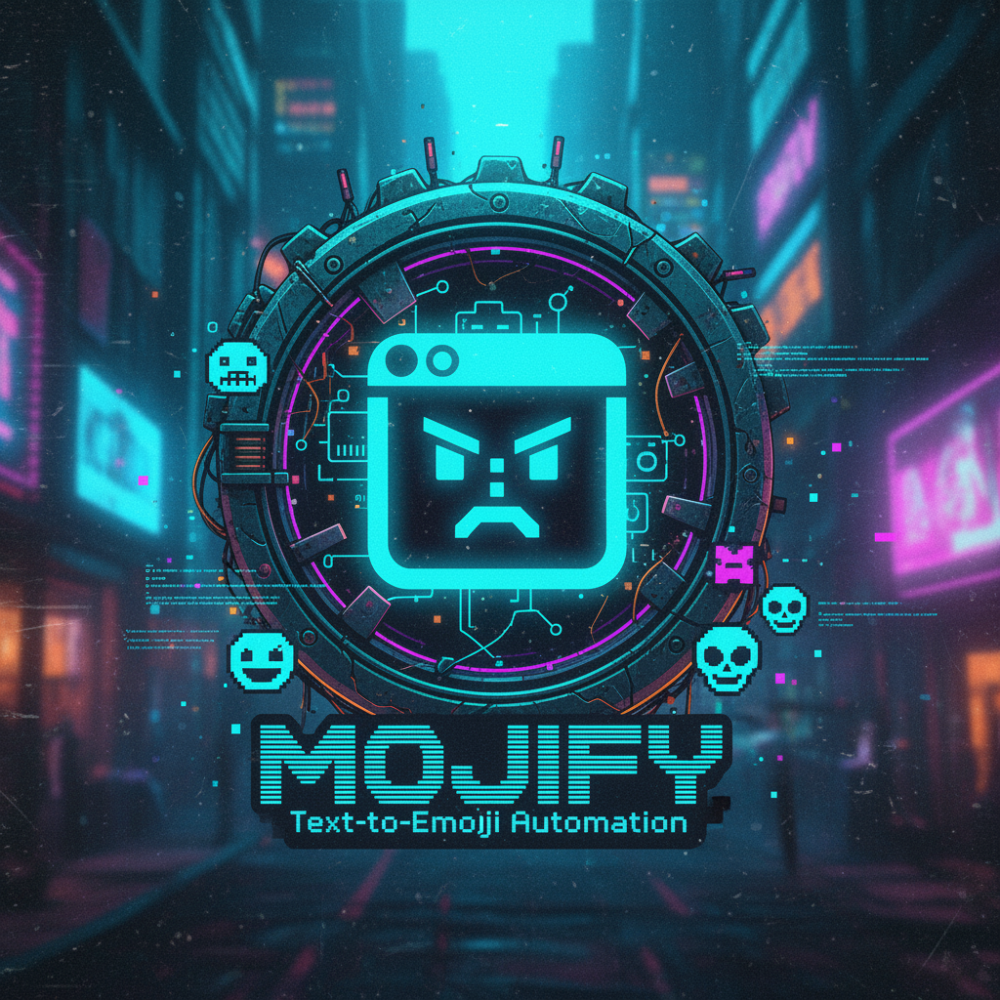

# Mojify

<p align="center">
  
</p>

<p align="center">
  <strong>A universal emote deck for the web.</strong><br>
  Search, import, cache, and insert Twitch, 7TV, Discord, and reaction media from one browser extension.
</p>

<p align="center">
  <a href="LICENSE"></a>
  
  
  
</p>

---

## What Is Mojify?

Mojify is a browser extension for people who live in emotes. It builds a local reaction library from Twitch/7TV channels, Discord servers, and media providers, then makes that library available through a fast popup, a typing minibar, and platform-specific insertion adapters.

It is designed around three ideas:

- **Own your reaction library.** Emotes are cached locally in IndexedDB so browsing stays fast after import.
- **Move faster than platform pickers.** Search, recent items, favorites, provider tabs, and channel/set filters keep the right emote close.
- **Respect the weird web.** Messenger, Discord, WhatsApp, Telegram, and Facebook all behave differently, so Mojify uses adapter-based insertion paths instead of pretending one method works everywhere.

## Highlights

- **Twitch and 7TV imports**: Add Twitch usernames or channel IDs, resolve them, and download their active 7TV emote sets.
- **7TV set browsing**: View available emote sets for a channel and download alternate sets into Mojify.
- **Discord server import**: Import custom emojis and stickers from the Discord server open in your browser.
- **Reaction media tabs**: Search Giphy, Klipy, and Pixabay when API keys are configured.
- **Smart minibar**: Type `:emote:` on supported pages and get quick suggestions near the composer.
- **Recent and favorites**: Keep frequently used reactions one click away.
- **Local-first storage**: Metadata and blobs live in the browser profile, with backup and restore support.
- **MV3 extension architecture**: Service worker, content script, popup UI, options page, and release workflow.

## Product Preview

<table>
  <tr>
    <td width="50%">
      <strong>Instant insertion</strong><br>
      
    </td>
    <td width="50%">
      <strong>Smart suggestions</strong><br>
      
    </td>
  </tr>
</table>

## Supported Sources

| Source | What Mojify imports | Notes |
| --- | --- | --- |
| Twitch + 7TV | Channel emotes and 7TV emote sets | Usernames require Twitch credentials; numeric IDs can be used directly. |
| Discord Web | Server custom emojis and stickers | Import works from the active Discord server tab. |
| Giphy | Search results | Requires a Giphy API key. |
| Klipy | Search results | Requires a Klipy API key. |
| Pixabay | Search results | Requires a Pixabay API key. |

## Supported Insertion Targets

| Target | Status | Notes |
| --- | --- | --- |
| Messenger | Supported | Uses site-specific insertion handling. |
| Discord Web | Supported | Local media insertion and Discord imports are separate features. |
| Facebook | Supported | Depends on composer shape. |
| Telegram Web | Supported | Depends on composer shape. |
| WhatsApp Web | Experimental | WhatsApp changes often and has stricter media handling. |

If a platform changes its composer, Mojify may need an adapter update. Please open a bug with the platform, browser version, and console error.

## Install From Source

1. Clone or download this repository.
2. Open Chrome or a Chromium browser.
3. Go to `chrome://extensions/`.
4. Enable `Developer mode`.
5. Click `Load unpacked`.
6. Select the `extension` directory.

## First Run

1. Open the Mojify extension popup.
2. Go to `Settings`.
3. Add Twitch usernames or numeric channel IDs.
4. Save the list. Mojify starts downloading automatically.
5. Open the `Emotes` tab and search or browse your local library.

For Discord imports:

1. Open Discord Web in a normal browser tab.
2. Navigate to the server you want to import.
3. Open Mojify and switch to the Discord provider.
4. Click `Import Open Server`.

## Repository Layout

```text
Mojify/
├── extension/                 # Chrome MV3 extension
│   ├── background.js          # Service worker, imports, downloads, insertion adapters
│   ├── content.js             # Page integration and minibar behavior
│   ├── popup.html             # Main extension interface
│   ├── popup.css              # Popup visual system
│   ├── popup.js               # Popup state, search, import, and grid logic
│   ├── options.*              # Provider key management
│   ├── vendor/                # Small bundled browser-side libraries
│   └── icons/                 # Extension icons
├── web/                       # Companion Twitch lookup web app
├── desktop/                   # Desktop experiments and Tauri prototype
├── .github/                   # Release workflow and community templates
├── docs/                      # Architecture and project notes
├── CHANGELOG.md
├── CONTRIBUTING.md
├── SECURITY.md
└── README.md
```

## Development

This repo is intentionally lightweight at the extension layer. Most checks can be run directly with Node syntax validation:

```bash
node --check extension/background.js
node --check extension/content.js
node --check extension/popup.js
node --check extension/options.js
```

For the companion web app:

```bash
cd web
pnpm install
pnpm dev
```

## Release Artifacts

The GitHub workflow in `.github/workflows/release-extension.yml` packages the `extension` directory as a ZIP and CRX artifact. It expects a `MOJIFY_EXTENSION_PEM_B64` secret for CRX signing.

## Privacy Model

- Mojify stores emote metadata, blobs, provider keys, and settings in browser-local storage.
- Mojify does not run a tracking backend for extension usage.
- Provider API keys are optional and stored locally through the options page.
- Discord imports read the currently open Discord Web server context to discover server media.
- Site insertion adapters only run in the browser context needed to place media into composers.

## Contributing

Mojify is friendly to focused contributions: bug fixes, provider import improvements, platform adapter fixes, UI polish, docs, and performance work.

Start with [CONTRIBUTING.md](CONTRIBUTING.md), then open an issue or pull request using the templates in `.github/`.

## Security

Please do not publish exploit details in public issues. Read [SECURITY.md](SECURITY.md) for responsible reporting guidance.

## Roadmap Themes

- More reliable platform-specific media insertion.
- Better import progress and resumability.
- Cleaner provider plug-in boundaries.
- Stronger performance with very large local emote libraries.
- Better docs for extension architecture and release flow.

## License

Mojify is released under the [MIT License](LICENSE).

## Acknowledgements

- 7TV and the Twitch emote community for the reaction culture Mojify builds around.
- Discord, Giphy, Klipy, and Pixabay for media ecosystems that make reaction libraries richer.
- Browser extension APIs for making local-first user tools possible.
