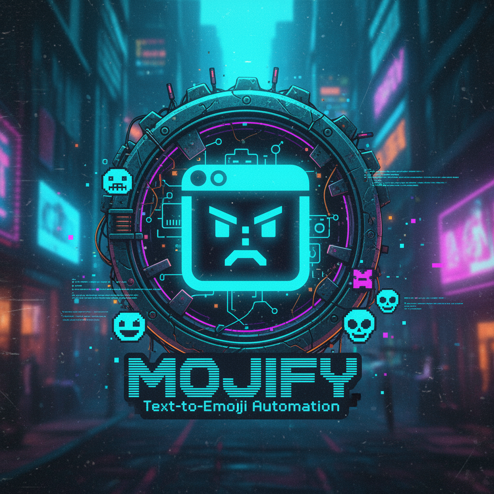

<p align="center">
  
</p>

<h1 align="center">Mojify</h1>

<p align="center">
  bring twitch/7tv emotes to any website — channel sync, media providers, popup deck<br>
  <b>mv3 browser extension</b> · <b>local-first library</b> · <b>adapter-based insertion</b>
</p>

<p align="center">
  <a href="LICENSE"></a>
  <a href="https://github.com/FahadBinHussain/mojify/releases/latest"></a>
  <a href="https://github.com/FahadBinHussain/mojify/actions/workflows/release-extension.yml"></a>
  
  
  
</p>

<table align="center">
  <tr>
    <td align="center" width="33%"><b>📺 twitch + 7tv sync</b><br>add channels once — mojify pulls<br>their active 7tv emote sets</td>
    <td align="center" width="33%"><b>🎮 discord + telegram import</b><br>grab server emoji/stickers or a<br>public sticker set by link</td>
    <td align="center" width="33%"><b>🔍 fast popup deck</b><br>search, recents, favorites,<br>provider tabs and set filters</td>
  </tr>
  <tr>
    <td align="center"><b>⌨️ :emote: minibar</b><br>type a trigger near any composer<br>and get inline suggestions</td>
    <td align="center"><b>🧩 adapter insertion</b><br>per-site paths for messenger, discord,<br>telegram, facebook, instagram</td>
    <td align="center"><b>💾 local-first</b><br>blobs cached in indexeddb with<br>backup/restore, no tracking backend</td>
  </tr>
</table>

## preview

<table>
  <tr>
    <td width="50%">
      <b>instant insertion</b><br>
      
    </td>
    <td width="50%">
      <b>smart suggestions</b><br>
      
    </td>
  </tr>
</table>

## supported sources

| source | what gets imported | notes |
| --- | --- | --- |
| twitch + 7tv | channel emotes and 7tv emote sets | usernames need twitch credentials; numeric ids work directly |
| discord web | server custom emojis and stickers | import runs from the server tab you have open |
| telegram | public sticker + custom emoji sets | needs a bot token; `.tgs` animated stickers need the optional native helper |
| giphy / klipy / pixabay | search results | one api key each, configured in settings |

## insertion targets

| target | status | notes |
| --- | --- | --- |
| messenger | ✅ | site-specific insertion handling |
| discord web | ✅ | local media insertion (separate from discord import) |
| facebook | ✅ | depends on composer shape |
| telegram web | ✅ | depends on composer shape |
| instagram dm | ✅ | attaches through the hidden media file input; a dm chat must be open |
| whatsapp web | ⚠️ experimental | whatsapp changes often and has strict media handling |

composers break without warning — if one stops working, open a bug with the
platform, browser version and console error.

## comparison

`✅` = the tool is built around that capability, `partial` = related feature but
not the same workflow, `-` = not the point of that tool.

| capability | mojify | [7tv](https://7tv.app/) | [betterttv](https://betterttv.com/) | [frankerfacez](https://www.frankerfacez.com/) | discord built-in | giphy/tenor-style pickers |
| --- | --- | --- | --- | --- | --- | --- |
| twitch/7tv emote import into a personal library | ✅ | partial | partial | partial | - | - |
| twitch/youtube/kick chat rendering + channel emote management | - | ✅ | ✅ | ✅ | - | - |
| discord server emoji/sticker import | ✅ | - | - | - | ✅ | - |
| telegram sticker/custom emoji set import | ✅ | - | - | - | - | - |
| local-first cache in the browser profile | ✅ | partial | partial | partial | partial | partial |
| search, recents, favorites, provider tabs | ✅ | ✅ | ✅ | ✅ | partial | ✅ |
| giphy/klipy/pixabay reaction search | ✅ | - | - | - | partial | ✅ |
| insert into messenger, facebook, telegram, discord, whatsapp, instagram | partial | - | - | - | partial | partial |
| adapter-based insertion for weird composers | ✅ | - | - | - | - | - |
| backup/restore of the personal library | ✅ | partial | partial | partial | partial | - |
| chat moderation and platform customization | - | partial | ✅ | ✅ | ✅ | - |

the mature emote extensions win at their home turf: rendering and managing
twitch-style chat emotes, and discord's own picker beats everything inside
discord. mojify aims elsewhere — collect reaction media once, keep it local,
then insert it on the messy social web where pickers don't reach.

honest gaps: whatsapp insertion is still unreliable, there's no channel-owner
management or twitch chat rendering, and import progress/resume needs polish.

## install

1. clone or download this repo
2. open `chrome://extensions/` (or `edge://extensions/`), enable **developer mode**
3. **load unpacked** → pick the `extension/` directory

every push also publishes a `Mojify-<version>.zip` + `.crx` on
[releases](https://github.com/FahadBinHussain/mojify/releases/latest) — grab
those if you'd rather not clone.

## first run

1. open the mojify popup → **settings**
2. add twitch usernames or numeric channel ids and save — downloads start
   automatically
3. open the **emotes** tab and search or browse your local library

**discord import:** open the server in a normal tab → mojify popup → discord
provider → **import open server**.

**telegram import:** settings → **open api key settings** → add a bot token →
emotes tab → telegram provider → paste `t.me/addstickers/UtyaDuck` or the short
name → **import set**.

### optional native tgs helper

animated telegram `.tgs` stickers are lottie files. without the helper mojify
skips them (no low-quality browser conversions in the library); with it, a
local chromium renders every frame and ffmpeg/libvpx-vp9 encodes lossless webm.

```powershell
scoop install nodejs ffmpeg
powershell -ExecutionPolicy Bypass -File native\telegram-tgs-host\install-native-host.ps1 -Browser Both
node native\telegram-tgs-host\mojify-native-host.js --self-test
```

reload the unpacked extension afterwards — native messaging is a manifest
permission.

## repo layout

| path | what |
| --- | --- |
| `extension/` | mv3 extension, plain js, no build step |
| `native/telegram-tgs-host/` | optional native messaging helper for lossless tgs conversion |
| `web/` | companion twitch lookup web app (`pnpm install && pnpm dev`) |
| `desktop/` | desktop experiments and tauri prototype |
| `docs/` | architecture and project notes |
| `.github/` | release workflow + issue/pr templates |

## development

no build step — edit `extension/*.js` raw, bump `version` in
`extension/manifest.json` in the same change, then
`pwsh tools/reload-extension.ps1`. checks:

```bash
node --check extension/background.js
node --check extension/content.js
node --check extension/popup.js
node --check extension/options.js
node native/telegram-tgs-host/mojify-native-host.js --self-test
```

every push runs `.github/workflows/release-extension.yml`: it packs the
extension into a zip + crx (signed with the `MOJIFY_EXTENSION_PEM_B64` secret)
and publishes a github release named after the manifest version — that's what
the release badge up top reports.

## privacy

- emote metadata, blobs, provider keys and settings live in browser-local
  storage only
- no tracking backend for extension usage
- provider api keys are optional and stored locally on the options page
- discord imports read only the discord web server tab you have open
- site adapters run only on the pages they insert into

## contributing

focused contributions welcome: bug fixes, provider import improvements, platform
adapter fixes, ui polish, docs, performance. start with
[CONTRIBUTING.md](CONTRIBUTING.md), then use the templates in `.github/`.

## security

no exploit details in public issues — see [SECURITY.md](SECURITY.md) for
responsible reporting.

## contributors

<a href="https://github.com/FahadBinHussain/mojify/graphs/contributors">
  
</a>

## license

[MIT](LICENSE)
